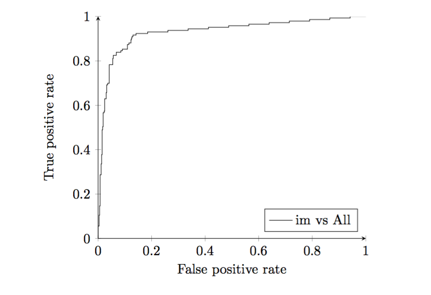
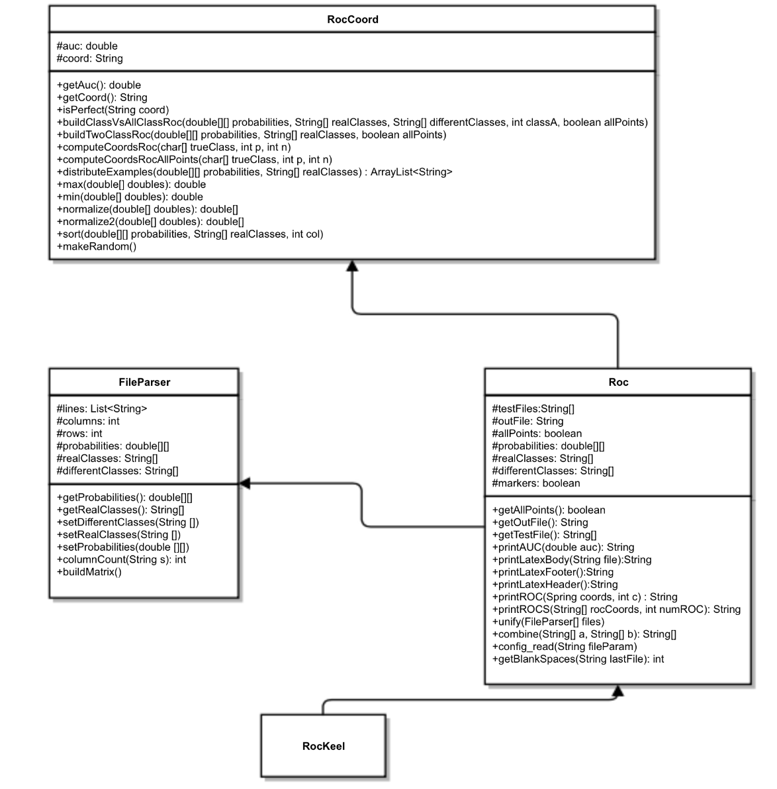
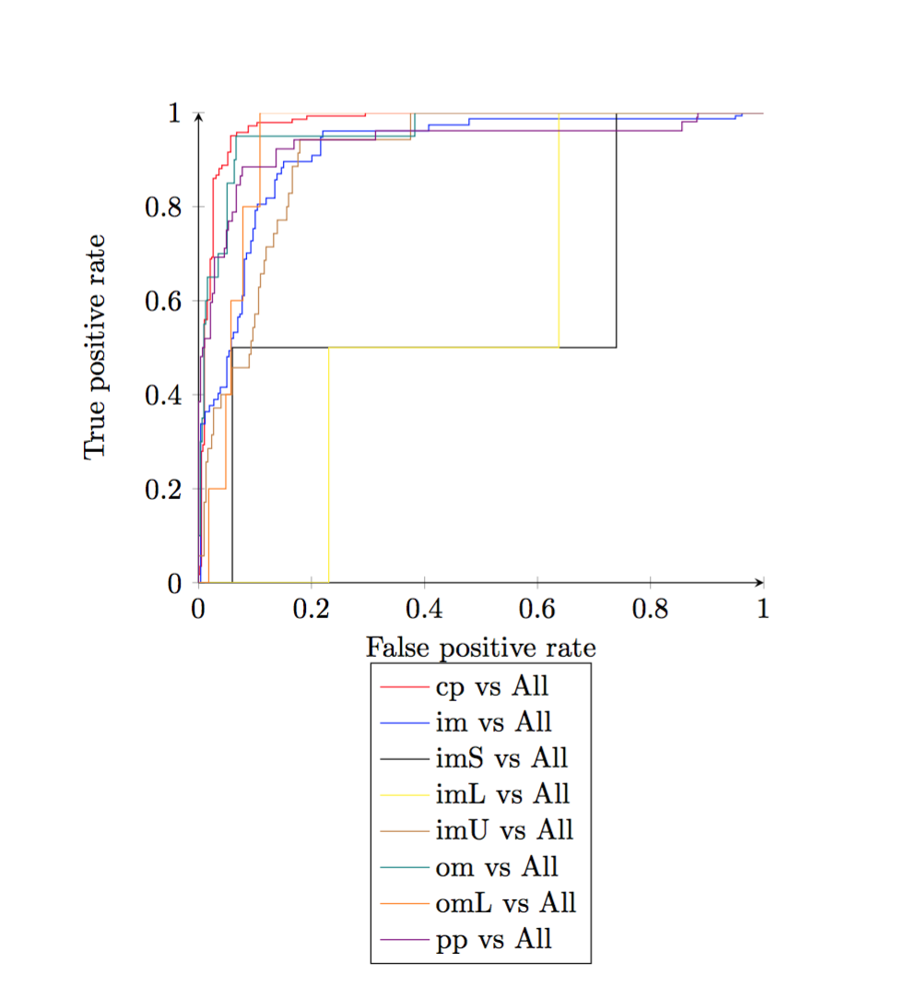

# tfgRocKeel

## Abstrac

Based on the algorithms modified in the [first part of the project](http://joseangeldiazg.github.io/probabilistic_keel/). A module has been developed that, based on the outputs of these algorithms, creates ROC curves. This module will be later added to the [KEEL software](http://www.keel.es) of the UGR, giving it a very interesting new functionality.

This website offers the reader a summary of the work done, which can be found in the following link: [Full Work](https://drive.google.com/open?id=0By8uWsmNWXG0anF1YXZOb3JFRUk).

## ROC Evaluation:

The ROC evaluation is based on the calculation of the area under the ROC curve, and besides solving the problems of other evaluation methods when evaluating a classifier in an unbalanced class problem or imbalance learning, offers the following advantages:

- The ROC evaluation allows a visual analysis of the behavior of a classifier as well as the visual comparison between different implementations.
- Through the AUC analysis we can obtain a quantitative evaluation of the classifier, as well as the quantitative evaluation between different examples.
- We can set different levels or thresholds in terms of costs or benefits depending on one or another class.
- It facilitates the possibility of logistical regressions and discriminatory analyzes.

The ROC curve is a graphical representation that represents for each of the examples or observations studied its relation between sensitivity and the complement of the specificity, in other words it allows us to see the separation between the distributions of the sensitivity And specificity for a particular problem.

## Software Development

In the following figure we can find a simplification of the class structure followed in the project development process. The simplification has been carried out to facilitate the understanding of the key points of this structure as well as to discard elements not relevant to the project.

The RocKeel class implements the main method of the program by creating an object of the class Roc that by means of its methods will execute the program in its totality. This has been done in this way following the code and methodology already existing in KEEL thus making it easier to understand.

The Roc class incorporates all the necessary code to:

 - Implement the full functionality of the program. Its constructor coordinates and uses all the structures necessary for the execution of the module.

 - Contain the input and output files of the scheduled (variables testFiles and outfile) for further processing.
 
 - Read the configuration files and perform their parseo to obtain the different arguments of the program.
 
- Define allPoints and markers parameters to give functionality to the program. The first gives the user the option of performing the ROC curve with all its points or only with the critical points. The second gives you the option to draw the points, or simply a line.
- Hosts the structures (probabilities, realClasses and differentClasses) and methods necessary to generate using objects of the classes FileParser and RocCoord everything necessary to elaborate the roc curves.
- It houses all necessary methods (textitprintAUC, printLatexHeader, printLatexBody, printLatexFooter) to dump the program output into Latex files.
- It contains the methods necessary for the representation, using the Pgfplots commands of a single ROC curve (printROC method) or several within the same graph (main methodROCS).

The FileParser class, incorporates all the necessary code to:

- Obtain from each of the input files obtained in the Roc class their contents in the form of lines (variable lines) as well as the number of columns and rows necessary to assemble the final structures.
- Obtain the necessary structures based on the above parameters, that is, the probability matrix to obtain the probabilities, the array with the real classes of each example (realClasses) and the different classes to take into account ( DifferentClasses). These parameters are computed using the buildMatrix method.
- Implement get / set methods that allow us to treat objects of this class without directly accessing them, favoring their reuse and increasing their reliability.

The RocCoord class is in charge of obtaining the coordinates for the ROC curves. It incorporates all the necessary code for generating binary problems from multi class problems, obtaining the ROC curves and being able to store in its attributes the coordinates of each curve and its AUC. Since it could be said that all the computational weight falls on this class and its methods, we have detailed in depth the most important ones.

- The sort method is responsible for sorting the examples according to the likelihood of the positive class from highest to lowest as discussed in previous chapters. This is a mandatory step in order to be able to work with all the other methods that will be explained below.
- The buildClassVsAllClassRoc method obtains the ROC curve of one of the classes in question, taken as positive, against all others that are taken as negative, that is, a multi-class problem obtains a binomial problem, using auxiliary methods Such as max, min, normalize and normalize2. This is one of the fundamental methods of work and confronts each class against all others. For this, the examples of the class in question (which will be treated as positive) are labeled positive and all others are of the class that they are, they are labeled negative. The probability values ​​will be the same as the multi-class problem, for the positive class and the maximum of the probabilities of all other classes as the probability of the negative class. Finally, we will normalize these values ​​again to the interval 0-1.

- The buildTwoClassRoc method obtains the ROC curve of a binomial problem, that is, with only two possible classes. This method is called by buildClassVsAllClassRoc before finalizing and it is responsible for counting the negative and positive examples that will be used to obtain the displacement on the X axis and the Y axis. The essential part of this algorithm resides in the redistribution of examples using the method distributeExamples whose operation will be explained later.
- Based on the parameters that the previous methods obtain, using the computeCoordsRoc method or the computeCoordsRocAllPoints method if its allPoints parameter in the Roc class indicates it, they are responsible for obtaining each of the points that will be part of the graph, accumulating the AUC in every step. This method works very simply:
- The first step is to obtain the size of each of the displacements on the X axis or the Y axis, for this use is made of the parameters p and n.
- Once we know the size of the displacements iterate along the array with the true class previously ordered according to their probabilities by entering a point in the coordinate string represented by the variable coords each time we find a positive in the Y axis and If it is negative on the X axis.
- Each time we include a new point that advances in the X axis in relation to its previous position in this axis, we compute the calculation of the AUC of the formed rectangle. Where the height will be the current value on the Y axis and the width will correspond to the difference between the value of the current and previous X axis.
- The distributeExamples method is one of the crucial ones. This method is responsible for redistributing examples of different classes with the same probability to prevent them from congregating at the beginning or at the end with the corresponding falsification of the results that this would entail. This method therefore calculates the proportion of negatives and positives for each block of examples with equal probability for the positive class and distributes them proportionally.

## Pgfplots Package

Pgfplots is a package based on TikZ / PGF, a complex graphic system developed for Latex that offers us great functionality when drawing graphics directly in Latex but whose commands are quite complex, what makes its learning curve Quite high.

Pgfplots therefore appears as a level of abstraction on TikZ / PGF and like the latter allows the creation of graphs of functions, points, bars and surfaces among other functionalities. One of its most interesting features is the ease of use, with a convenient interface and scripts directly compilable in Latex. The graphics are inserted into the Latex document in a vectorial way so its resolution and quality is not affected by increasing or decreasing its size. Pgfplots also allows the realization of graphics in 2D or 3D with a lot of adaptable parameters, such as legends, colors and labels with which we can give our graphics the appropriate design characteristics for each problem in question. For our problem, we used 2D graphics and the following Pgfplots commands:

- **Begin {tikzpicture} graph comands end {tikzpicture}**: Our graph and configuration commands must go inside this structure in order to function correctly.

- **Begin {axis} [axis comands] end {axis}**: If we want to format the elements of the graph, the commands (axis comands) must be entered using this structure, which in turn will go inside the previous one. The commands for the axis can be very varied and they serve to locate the legend, to choose the color of the graph or to use points or lines among other functionalities.

- **Addplot coordinates {list of points}**: With this command entering the list of points generated by our module for an ROC curve in question, we insert in the desired place of our document Latex the curve in question, taking into account that This command must be used in conjunction with the two aforementioned structures.

## Output

In the following figure we can see the output of the developed module working with a real multi-class problem:

